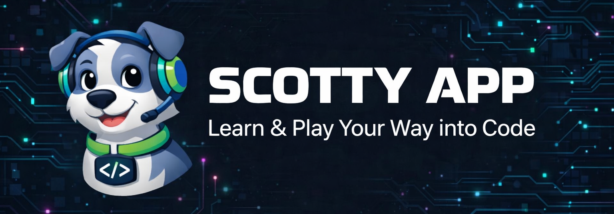

  

<h1 align="center">Scotty App</h1>

  <strong>Juega · Aprende · Programa</strong>  
  Plataforma educativa gamificada para practicar programación mediante quizzes interactivos. 
  Aprende a tu ritmo, supera retos y sube de nivel mientras dominas el código.

  
  
  
  

---

## 🎯 ¿Qué es Scotty App?

Scotty App es una plataforma web gamificada pensada para estudiantes de programación. A través de quizzes interactivos, los usuarios pueden reforzar sus conocimientos de forma dinámica y entretenida, acumulando puntos y avanzando por niveles a medida que dominan nuevos conceptos.

El proyecto nace en el aula como trabajo de fin de curso del ciclo **DAW 1º** del **IES Mutxamel** (curso 2025–2026), desarrollado con metodología Scrum en sprints iterativos.

---

## 👥 El equipo

  <table>
    <tr>
      <td align="center">
         
        <b>Manuela</b> 
        🛡️ Scrum Master · DevOps
      </td>
      <td align="center">
         
        <b>Iván</b> 
        🎨 UX/UI Designer
      </td>
      <td align="center">
         
        <b>José Ramón</b> 
        ⚙️ Analista de Sistemas
      </td>
      <td align="center">
         
        <b>José Luis</b> 
        📊 Analista de Negocio
      </td>
    </tr>
  </table>

---

## 🗂️ Estructura del proyecto

Este repositorio es el punto de entrada a la organización **Scotty App**. El proyecto está dividido en cuatro repositorios especializados:

| Repositorio | Descripción | Tecnologías |
|---|---|---|
| [Scotty-App-Frontend](https://github.com/Scotty-App/Scotty-App-Frontend) | Plataforma web accesible desde el navegador | HTML · CSS · JavaScript |
| [Scotty-App-Backend](https://github.com/Scotty-App/Scotty-App-Backend) | Aplicación administrativa de gestión de contenidos | Java · JavaFX |
| [Scotty-App-Database](https://github.com/Scotty-App/Scotty-App-Database) | Esquema, migraciones y datos de la base de datos | SQL Server · MariaDB |
| [Scotty-App-Docs](https://github.com/Scotty-App/Scotty-App-Docs) | Documentación técnica y funcional del proyecto | Word · PDF · Video |

---

## 🛠️ Stack tecnológico

| Área | Tecnologías |
|:---|:---|
| **Frontend** |  |
| **Backend** |  |
| **Base de datos** |  |
| **Control de versiones** |  |
| **Gestión del proyecto** |  |

---

## 🌐 Demo

La plataforma web está desplegada en **CDMON** y es accesible desde cualquier navegador.

> ⚠️ **Nota:** El acceso requiere usuario y contraseña debido a las limitaciones del servidor gratuito. En un entorno de producción real, la URL sería de acceso directo y público.

---

## 📋 Gestión del proyecto

- **Tablero Kanban:** [Trello — Scotty App](https://trello.com/b/sttwpXvy/scotty)
- **Metodología:** Scrum (sprints iterativos con reuniones de revisión y retrospectiva)
- **Centro educativo:** IES Mutxamel · Ciclo DAW 1º · Curso 2025–2026

---

## 🚀 Primeros pasos

Para explorar cualquier parte del proyecto, accede al repositorio correspondiente desde la sección [Estructura del proyecto](#️-estructura-del-proyecto). Cada repositorio incluye su propio `README.md` con instrucciones de instalación y ejecución en local.

---

  Hecho con ❤️ por el equipo Scotty App · IES Mutxamel · 2025–2026

